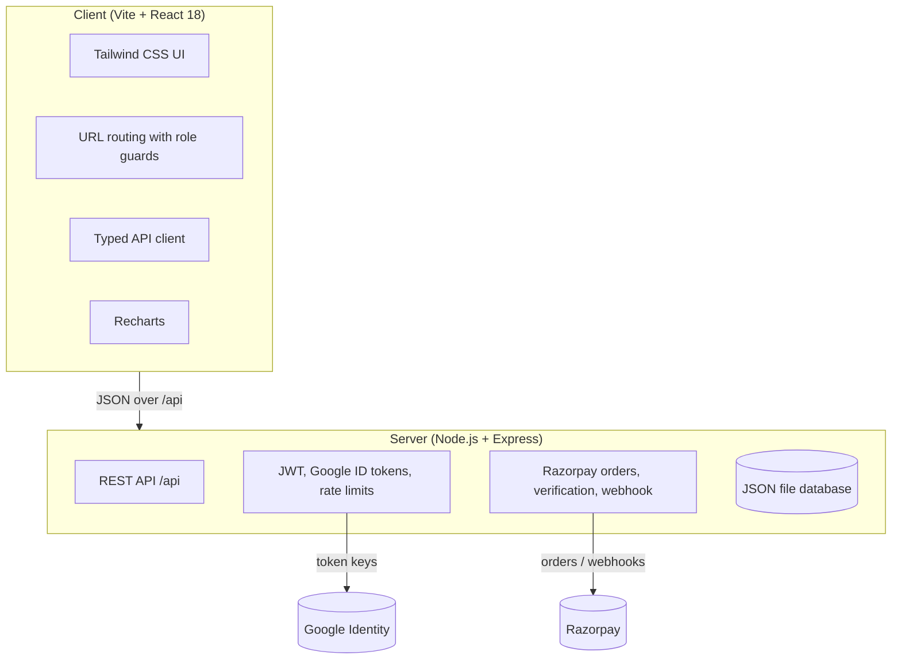

# ⚡ PULSEFIT ATHLETICS — Cyber Hub, Gurugram

<div align="center">


### 🏋️ Gym website, member portal, coach dashboard and front-desk system
**For a Strength Training and Zumba & Cardio gym in Cyber Hub, Gurugram.**

---

[](https://react.dev/)
[](https://www.typescriptlang.org/)
[](https://vitejs.dev/)
[](https://tailwindcss.com/)
[](https://nodejs.org/)
[](https://expressjs.com/)
[](https://razorpay.com/)
[](https://vitest.dev/)
[](https://playwright.dev/)

[Features](#-feature-highlights) • [Plans](#-membership-plans) • [Demo personas](#-1-click-demo-personas) • [Quick start](#-quick-start) • [Configuration](#%EF%B8%8F-configuration) • [Testing](#-testing) • [Deploying](#-deploying) • [API](#-api) • [Changelog](CHANGELOG.md)

---

</div>

## 📖 Overview

**PulseFit** is a full-stack gym web application built around **two fitness pillars**:

1. **Workout & Strength Training**: free weights, power racks, compound lifts, a set-by-set workout logger.
2. **Zumba & Cardio**: high-energy dance fitness and aerobic conditioning classes.

Visitors browse the timetable and buy a plan through **Razorpay in Indian Rupees (₹)**. Members book
classes, check in at the turnstile with a QR pass, log workouts and track their streak. Coaches run their
rosters and keep client notes, and the front desk and admins manage members, the timetable, plans and
revenue. Everything runs on India Standard Time.

**What's new in v2.1:** the coach dashboard, real QR passes and camera scanning, a payments ledger with
invoices, saved free trials, admin pages for classes, plans and trial leads, real URLs for every page, and
a security overhaul. See the [changelog](CHANGELOG.md).

---

## ⚡ 2 Core Fitness Offerings

<table>
  <tr>
    <td width="50%" align="center">
      <h3>💪 1. Workout & Strength Training</h3>
      <p>Muscle building, progressive overload and functional strength.</p>
      <ul align="left">
        <li>Olympic barbells, power cages and dumbbells</li>
        <li>Coached compound lifts (squat, deadlift, bench press)</li>
        <li>Workout logger with per-exercise sets, RPE and a rest timer</li>
        <li>Exercise library with target muscles and form cues</li>
      </ul>
    </td>
    <td width="50%" align="center">
      <h3>💃 2. Zumba & Cardio Dance</h3>
      <p>Calorie burn, stamina and high-energy fun.</p>
      <ul align="left">
        <li>Latin and Bollywood dance choreography</li>
        <li>Morning and evening batches, Monday to Saturday</li>
        <li>Led by certified Zumba instructors</li>
        <li>Per-class capacity with live spots-left counts</li>
      </ul>
    </td>
  </tr>
</table>

Open **Monday to Saturday, 06:00–22:00 IST**. Closed on Sundays.

---

## 💰 Membership Plans

Plans, prices and what each plan may book live in the **plan catalogue**. Admins edit them on the
**Plans** admin page (`/admin/plans`), and the website and checkout read them from `GET /api/plans`. The demo data
ships with:

| Plan | Books | Monthly | Annual (billed once) |
| :--- | :--- | :--- | :--- |
| **Workout & Strength Pass** | Workout & Strength classes | **₹699** | **₹7,188** (₹599/mo) |
| **Zumba & Cardio Pass** | Zumba & Cardio classes | **₹799** | **₹8,388** (₹699/mo) |
| **Dual All-Access Pass** ⭐ | Everything | **₹999** | **₹10,188** (₹849/mo) |

Renewing extends from the current expiry. Switching plans credits the unused days of the old plan.
A freeze pauses the plan and gives back the open gym days missed while frozen (not the freeze day, the return day or Sundays).

---

## 🌟 Feature Highlights

<table>
  <tr>
    <td width="50%">
      <h3>🌐 Visitors</h3>
      <ul>
        <li>Strength and Zumba pages, fitness guide, coach profiles</li>
        <li>Weekly timetable with week navigation, filters and live spots left</li>
        <li>Pricing from the plan catalogue, with checkout through Razorpay</li>
        <li>Free 1-day trial: a code valid once on the chosen day, saved as a lead</li>
        <li>Sign up with email or Google; password reset by link</li>
      </ul>
    </td>
    <td width="50%">
      <h3>🏋️ Members</h3>
      <ul>
        <li>Dashboard with streak, membership status, upcoming classes, check-in history and coach notes</li>
        <li>Book and cancel classes (checked against the plan, membership dates and capacity)</li>
        <li>Scannable QR turnstile pass</li>
        <li>Workout logger, progress charts and personal records</li>
        <li>Floor clock-in/out, plan changes, freeze/unfreeze, invoices</li>
      </ul>
    </td>
  </tr>
  <tr>
    <td width="50%">
      <h3>🥋 Coaches</h3>
      <ul>
        <li>Coach dashboard: upcoming classes, booked sessions of the last 14 days with attendance, clients and notes; admins can open any coach's dashboard</li>
        <li>Rosters per class and date, with attended / no-show marking</li>
        <li>Client list and assessment notes, optionally shared with the member</li>
        <li>Front-desk check-in scanner</li>
      </ul>
    </td>
    <td width="50%">
      <h3>🛡️ Admin & front desk</h3>
      <ul>
        <li>KPIs from real data: MRR, revenue, check-ins, fill rate, retention, peak hours, tiers</li>
        <li>Member directory: create, edit, freeze, reset password, delete, visit and payment history</li>
        <li>QR check-in by camera or code, with clear granted/denied reasons</li>
        <li>Timetable, coaches, plans & pricing, free-trial leads, attendance CSV export</li>
      </ul>
    </td>
  </tr>
</table>

---

## 🎭 1-Click Demo Personas

In **demo mode** (on by default in local development, off in production) the sign-in screen offers four
personas. All of them use the password `pulse123`:

| Persona | Role | Email | What to try |
| :--- | :--- | :--- | :--- |
| **Aarav Sharma** | 🥇 Member, Zumba & Cardio Pass | `member@pulsefit.com` | Book a Zumba class, show the QR pass, log a workout |
| **Ananya Gupta** | 💎 Member, Dual All-Access | `vip@pulsefit.com` | Book any class, invoices, freeze and unfreeze |
| **Coach Vikram Rathore** | 🥋 Head strength coach | `trainer@pulsefit.com` | Rosters, attendance marking, client notes |
| **Priya Verma** | 👑 Admin / general manager | `admin@pulsefit.com` | Dashboard, members, check-in scanner, plans |

> ⚠️ The demo accounts and their password are public. Never turn on demo mode on a server holding real
> member data. Production never loads them unless `DEMO_MODE=true` is set explicitly.

---

## 🛠️ Technology Stack



- **Client**: React 18, TypeScript, Vite, Tailwind CSS, lucide-react, Recharts, `qrcode`, canvas-confetti
- **Server**: Node.js 20+, Express 4, TypeScript (tsx), zod, bcryptjs, jsonwebtoken, jose, helmet, express-rate-limit, Razorpay SDK
- **Data**: a JSON file database (`server/data/gym-db.json`) with atomic writes; created and seeded on first start
- **Tests**: Vitest + supertest for the API, Playwright for the browser, GitHub Actions CI

---

## 🚀 Quick Start

**Prerequisites:** Node.js 20 or newer, npm 9 or newer.

```bash
git clone https://github.com/budhpreaygautam/PulseFit.git
cd PulseFit
npm run install:all   # root, server and client dependencies
npm run dev           # API on :5004 and the web app on :5173
```

Open **http://localhost:5173**. On first start the API creates `server/data/gym-db.json` with the demo gym.
No configuration is needed for local development: demo personas are on, and online payments and Google
sign-in stay hidden until you add their keys.

Reset the demo data at any time with `npm run seed`. To start without demo data, use
`npm run seed -- --catalogue`, which loads only the plans, exercises, coaches and timetable.

<details>
<summary>Optional: local HTTPS for the Vite dev server</summary>

Put a certificate and key at `client/certs/cert.pem` and `client/certs/key.pem` (for example generated with
[mkcert](https://github.com/FiloSottile/mkcert): `mkcert -key-file client/certs/key.pem -cert-file client/certs/cert.pem localhost`).
Vite then serves https://localhost:5173. The folder is git-ignored.
</details>

---

## ⚙️ Configuration

Copy `server/.env.example` to `server/.env`. Every setting is optional for local development.

| Variable | Purpose |
| :--- | :--- |
| `JWT_SECRET` | Signs login tokens. **Required outside local development** (32+ random characters). |
| `NODE_ENV` | `development`, `production` or `test`. If unset, `npm run dev` is development and `npm start` is production. |
| `DEMO_MODE` | `true` enables the 1-click personas. Default: on in development, off elsewhere. |
| `CLIENT_ORIGIN` | Browser origins allowed to call the API (comma-separated). |
| `TRUST_PROXY` | Number of reverse proxies in front of the API (e.g. `1` on Render/Railway/nginx). |
| `GYM_TIMEZONE` | Default `Asia/Kolkata`. |
| `PUBLIC_URL` | The address people open the app at (e.g. `https://gym.example.com`); password reset links are built on it. Set it in production. |
| `ENFORCE_OPENING_HOURS` | Default `true`: members cannot check in, clock in or book a same-day trial while the gym is closed. The test suites turn it off. |
| `RAZORPAY_KEY_ID`, `RAZORPAY_KEY_SECRET` | Enable checkout ([Razorpay dashboard → API keys](https://dashboard.razorpay.com/app/keys); use test-mode keys first). |
| `RAZORPAY_WEBHOOK_SECRET` | Enables `POST /api/payment/webhook`, so a payment still activates if the member closes the tab. |
| `GOOGLE_CLIENT_ID` | Enables "Continue with Google" (an OAuth web client id; add your site as an authorised JavaScript origin). |
| `PULSEFIT_DB_PATH` | Where the JSON database lives. |
| `SERVE_CLIENT` | Serve `client/dist` from the API (default on in production). |

The client needs no secrets. It reads what is enabled from `GET /api/config`.

**Razorpay webhook:** in the Razorpay dashboard, add `https://<your-domain>/api/payment/webhook` with the
events `payment.captured`, `order.paid` and `payment.failed`, and use the same secret as `RAZORPAY_WEBHOOK_SECRET`.

---

## 🧪 Testing

```bash
npm test            # 485 API tests (Vitest + supertest), each file on its own throwaway database
npm run test:e2e    # 42 Playwright tests: builds the client, starts the API on a fresh demo database, runs Chromium (desktop + mobile)
npm run typecheck   # server, client and e2e
```

The first Playwright run needs a browser: `npx playwright install chromium`. CI (`.github/workflows/ci.yml`)
runs the type checks, API tests, build and Playwright suite on every push and pull request.

---

## 🚢 Deploying

```bash
npm run install:all
npm run build                                    # compiles the API to server/dist and the client to client/dist
JWT_SECRET=<long random string> npm start        # one process serves the API and the web app on $PORT
```

On a first start without `DEMO_MODE`, the database gets the catalogue but no accounts. With the API
stopped, create the first admin:

```bash
npm run create-admin -- --email you@example.com --name "Your Name"   # prints a temporary password once
```

The database is a single JSON file, so run one instance, keep `server/data/` on a persistent disk, and back
it up. Behind a proxy, set `TRUST_PROXY`. Set `PUBLIC_URL` to your site's address so password reset links work.
For checkout, set the Razorpay keys and webhook secret.

---

## 📂 Project Architecture

```text
PulseFit/
├── package.json              # install:all, dev, test, test:e2e, build, start, seed, create-admin
├── docs/API.md               # the full API reference
├── e2e/                      # Playwright: page smoke tests, access rules, booking, check-in, pricing
├── server/
│   ├── src/
│   │   ├── index.ts          # startup, first-start seeding, graceful shutdown
│   │   ├── server.ts         # Express app: security headers, CORS, JSON, static client
│   │   ├── config.ts         # every environment variable, resolved once
│   │   ├── routes/           # auth, payments, classes, members, activity
│   │   ├── controllers/      # one per area (auth, password, plans, payments, membership, classes,
│   │   │                     #   bookings, trainers, trainer portal, members, attendance, trials,
│   │   │                     #   workouts, time tracking, analytics)
│   │   ├── lib/              # IST dates, membership rules, streaks, billing, occurrences, floor, http
│   │   ├── middleware/       # JWT auth, role guards, error handling
│   │   └── db/               # JSON database, seed (+ per-domain seed modules), create-admin
│   └── tests/                # Vitest + supertest
└── client/
    └── src/
        ├── App.tsx           # pages, lazy loading and access guards
        ├── routes.ts         # every page's URL and who may open it
        ├── api/client.ts     # typed API client and ApiError
        ├── context/          # auth, config, navigation, theme, toasts
        ├── components/       # layout, common UI, auth, QR pass, admin/coach/member widgets
        └── pages/            # public/, member/, trainer/, admin/
```

---

## 📡 API

The full reference, with every request, response and error code, is in **[docs/API.md](docs/API.md)**.
In short:

- **Auth**: `POST /api/auth/login`, `/register`, `/google`, `/demo-login`, `/forgot-password`, `/reset-password`; `GET /api/auth/me`; `PUT /api/auth/profile`, `/password`
- **Plans & payments**: `GET /api/plans`; `POST /api/payment/create-order`, `/verify`, `/webhook`; `GET /api/payments/my`; `POST /api/membership/freeze`, `/unfreeze`
- **Classes & bookings**: `GET /api/classes`; `POST /api/bookings`; `GET /api/bookings/my`; `DELETE /api/bookings/:id`; rosters and attendance
- **Coaches**: `GET /api/trainers`; `GET /api/trainer/me`, `/clients`, `/notes`; `GET /api/notes/my`
- **Front desk & admin**: `POST /api/attendance/check-in`; `GET /api/attendance/logs`; `/api/members` CRUD; `POST /api/trials`; `GET /api/analytics/dashboard`
- **Activity**: `/api/workouts`, `/api/exercises`, `/api/time-tracking/*`

---

## 📍 Gurugram Location & Contact

- 🏢 **Facility**: Plot 42, Sector 29, Near Cyber Hub, Gurugram, Haryana 122002, India
- 📞 **Phone**: `+91 98110 PULSE (78573)`
- ✉️ **Email**: `contact@pulsefit.in`
- 🌐 **Web**: `https://pulsefit.in`
- 📸 **Instagram**: `@pulsefit.gurugram`

---

## 📄 License

This project is licensed under the **MIT License** — see the [LICENSE](LICENSE) file for details.

<div align="center">
  <sub>Engineered with ❤️ for the Gurugram Fitness Community.</sub>
</div>
