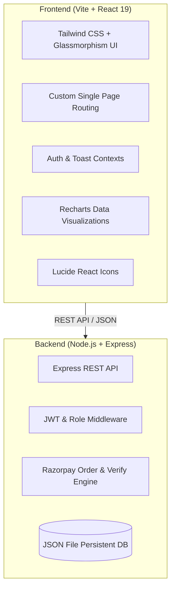

# ⚡ PULSEFIT ATHLETICS — Cyber Hub, Gurugram

<div align="center">


### 🏋️ High-Performance Gym, Member Portal & Turnstile Management Platform
**Built exclusively for Strength Training Athletes and Zumba & Cardio Lovers in Cyber Hub, Gurugram.**

---

[](https://react.dev/)
[](https://www.typescriptlang.org/)
[](https://vitejs.dev/)
[](https://tailwindcss.com/)
[](https://nodejs.org/)
[](https://expressjs.com/)
[](https://razorpay.com/)
[](https://localhost:5173)
[](https://maps.google.com)

[Explore Features](#-feature-highlights) • [2 Core Fitness Offerings](#-2-core-fitness-offerings) • [Pocket-Friendly Pricing](#-affordable-membership-plans) • [1-Click Demo Accounts](#-1-click-interactive-demo-personas) • [Quick Start](#-quick-start)

---

</div>

## 📖 Overview

**PulseFit** is a full-stack, enterprise-grade gym web application engineered with modern aesthetics, high-contrast dark/light glassmorphism, and minimal visual clutter. Designed with an authentic athletic identity inspired by Gurugram's bustling tech and fitness corridor, PulseFit focuses on **two core fitness pillars**:
1. **Workout & Strength Training Sessions**: Heavy compound lifts, dumbbells, power racks, hypertrophy routines, and set logging.
2. **Zumba & Cardio Sessions**: High-energy dance fitness, calorie-burning parties, and aerobic conditioning.

It delivers real-time class booking, turnstile optical QR scanning, workout set logging, and seamless Razorpay payment gateways in Indian Rupees (₹ INR) at **medium, pocket-friendly subscription prices**.

---

## ⚡ 2 Core Fitness Offerings

<table>
  <tr>
    <td width="50%" align="center">
      <h3>💪 1. Workout & Strength Training</h3>
      <p>Targeted for muscle building, progressive overload, and functional strength.</p>
      <ul align="left">
        <li>Olympic barbells, power cages, dumbbells up to 50kg</li>
        <li>Compound movement guidance (Squats, Deadlifts, Bench Press)</li>
        <li>Interactive rep & weight set tracker with rest timer</li>
        <li>12+ animated exercise directory with target muscle breakdowns</li>
      </ul>
    </td>
    <td width="50%" align="center">
      <h3>💃 2. Zumba & Cardio Dance</h3>
      <p>Targeted for maximum calorie burn, stamina, and high-energy fun.</p>
      <ul align="left">
        <li>Infectious Latin & Bollywood rhythmic dance choreography</li>
        <li>450–650 kcal burned per high-energy session</li>
        <li>Led by certified master Zumba instructors</li>
        <li>Daily morning and evening batches for busy professionals</li>
      </ul>
    </td>
  </tr>
</table>

---

## 💰 Affordable Membership Plans

| Plan | Target | Monthly Price | Annual Billing (Save 15%) | Key Perks |
| :--- | :--- | :--- | :--- | :--- |
| **Workout & Strength Pass** | Strength Athletes | **₹699** / mo | **₹599** / mo (₹7,188/yr) | Full gym floor, free weights, daily strength tracker |
| **Zumba & Cardio Pass** | Cardio & Dance Lovers | **₹799** / mo | **₹699** / mo (₹8,388/yr) | Unlimited Zumba classes, dance floor, calorie tracker |
| **Dual All-Access Pass** | ⭐ *Best Value* | **₹999** / mo | **₹849** / mo (₹10,188/yr) | Unlimited Strength + Zumba, trainer form check, priority booking |

---

## 🌟 Feature Highlights

<table>
  <tr>
    <td width="50%">
      <h3>🌐 1. Public Discovery & Marketing</h3>
      <ul>
        <li><b>Minimalist Hero Experience</b>: High-impact typography, real-time membership counters, and direct action triggers.</li>
        <li><b>Focused Gurugram Facilities</b>: Strength Arena, Zumba & Cardio Dance Studio, Locker Rooms & Showers.</li>
        <li><b>Interactive Timetable</b>: Live filtering between <i>Workout & Strength</i> and <i>Zumba & Cardio</i>.</li>
        <li><b>Transparent INR Pricing</b>: ₹699, ₹799, and ₹999 tiers with integrated Razorpay checkout.</li>
        <li><b>Instant 1-Day VIP Trial Pass</b>: Instant digital voucher generator with celebration confetti.</li>
      </ul>
    </td>
    <td width="50%">
      <h3>🏋️ 2. Member Performance Hub</h3>
      <ul>
        <li><b>Dynamic Digital QR Pass</b>: Real-time turnstile pass modal with optical barcode and token copying.</li>
        <li><b>Workout Streak Tracker</b>: Visual streak flame meters and monthly volume tonnage records.</li>
        <li><b>1-Click Class Booking</b>: Reserve Strength or Zumba slots with automated conflict checks.</li>
        <li><b>Interactive Workout Logger</b>:
          <ul>
            <li>Live session tonnage & RPE tracking</li>
            <li>Warmup vs Working set flags</li>
            <li>Rest Stopwatch with 30s, 60s, 90s, and 180s presets</li>
          </ul>
        </li>
        <li><b>12+ Movement Library</b> with muscle targeting and form cues.</li>
      </ul>
    </td>
  </tr>
  <tr>
    <td width="50%">
      <h3>🛡️ 3. Staff & Admin Suite</h3>
      <ul>
        <li><b>Executive KPI Dashboard</b>:
          <ul>
            <li>Monthly Recurring Revenue (MRR in ₹)</li>
            <li>Active Members, Daily Check-Ins, Class Utilization %</li>
            <li>Attendance Bar Chart (Mon–Sun) & Revenue Donut Chart</li>
            <li>Hourly Traffic Curve (06:00 to 21:00 peak hours)</li>
          </ul>
        </li>
        <li><b>Member Directory</b>: Fast search, status filters (Active, Expired, Frozen), plan editing, and token management.</li>
        <li><b>Optical Turnstile Simulator</b>: High-speed barcode scanning with instant green/red verification.</li>
      </ul>
    </td>
    <td width="50%">
      <h3>💳 4. Razorpay & Indian Localization</h3>
      <ul>
        <li><b>INR Currency Standardized</b>: All monthly & annual tiers formatted in ₹.</li>
        <li><b>Razorpay Payment Gateway</b>: Automated order generation (`POST /api/payment/create-order`) and HMAC SHA256 verification (`POST /api/payment/verify`).</li>
        <li><b>Indian Personas & Coaching Roster</b>: Real-world profiles (Aarav, Ananya, Priya, Coach Vikram, Kavya Sen, Rohan Mehta, Simran Kaur).</li>
        <li><b>Cyber Hub Gurugram Location</b>: Plot 42, Sector 29, Gurugram, Haryana 122002.</li>
      </ul>
    </td>
  </tr>
</table>

---

## 🎭 1-Click Interactive Demo Personas

PulseFit comes with an **instant demo switcher** in the top navigation bar. Click any persona to instantly test their portal experience:

| Persona | Role | Credentials | Access & Sample Data |
| :--- | :--- | :--- | :--- |
| **Aarav Sharma** | 🥇 **Pro Member** | `member@pulsefit.com` / `pulse123` | 14-day streak, ₹799 Zumba Pass, booked classes, personal QR pass |
| **Ananya Gupta** | 💎 **VIP Member** | `vip@pulsefit.com` / `pulse123` | 9-day streak, ₹999 Dual Access VIP tier, priority check-in |
| **Priya Verma** | 👑 **Admin / General Manager** | `admin@pulsefit.com` / `pulse123` | Financial KPI analytics in ₹, member directory, turnstile scanner tool |
| **Coach Vikram** | 🥋 **Head Strength Coach** | `trainer@pulsefit.com` / `pulse123` | Trainer dashboard, class attendance rosters, client assessment notes |

---

## 🛠️ Technology Stack



- **Frontend**: [React 19](https://react.dev/), [TypeScript](https://www.typescriptlang.org/), [Vite](https://vitejs.dev/), [Tailwind CSS](https://tailwindcss.com/), [Lucide React](https://lucide.dev/), [Recharts](https://recharts.org/), [Canvas Confetti](https://www.npmjs.com/package/canvas-confetti)
- **Backend**: [Node.js](https://nodejs.org/), [Express](https://expressjs.com/), [TypeScript](https://www.typescriptlang.org/), [bcryptjs](https://www.npmjs.com/package/bcryptjs), [jsonwebtoken](https://www.npmjs.com/package/jsonwebtoken), [cors](https://www.npmjs.com/package/cors)
- **Data Engine**: Persistent JSON-backed zero-configuration transactional database (`server/data/gym-db.json`)
- **Security**: Local Trusted HTTPS root CA certificates generated via `mkcert`

---

## 🚀 Quick Start

### Prerequisites
- **Node.js**: v18.0.0 or higher
- **npm**: v9.0.0 or higher

### 1. Clone the Repository
```bash
git clone https://github.com/budhpreaygautam/PulseFit.git
cd PulseFit
```

### 2. Install Dependencies
```bash
# Install root, backend, and frontend dependencies in one command
npm run install:all
```

### 3. Seed Realistic Database
```bash
# Seeds demo accounts, Strength & Zumba classes, coaches, and affordable INR plans
npm run seed
```

### 4. Run Development Servers
```bash
# Concurrently starts Express API on :5004 and Vite Client on :5173
npm run dev
```

Open **`https://localhost:5173`** (or `http://localhost:5173`) in your browser to view PulseFit!

---

## 📂 Project Architecture

```text
PulseFit/
├── package.json                   # Root workspace scripts & concurrently runner
├── README.md                      # Project documentation
├── server/                        # Express Backend
│   ├── src/
│   │   ├── index.ts               # Server startup entry point
│   │   ├── server.ts              # Express configuration & routes
│   │   ├── controllers/           # Auth, classes, bookings, workouts, payments, analytics
│   │   ├── middleware/            # JWT authentication, role guards & validation
│   │   ├── routes/                # Express API router definitions
│   │   └── db/
│   │       ├── database.ts        # Persistent JSON database driver
│   │       └── seed.ts            # Strength & Zumba dataset seeder
│   └── data/
│       └── gym-db.json            # Persistent JSON database file
│
└── client/                        # React 19 Frontend
    ├── src/
    │   ├── App.tsx                # Master app container & routing logic
    │   ├── context/               # AuthContext & ToastContext providers
    │   ├── api/                   # Typed API service clients
    │   ├── components/
    │   │   ├── common/            # Modal, Badge, StatCard, Dropdown, Button
    │   │   ├── layout/            # Navbar with persona switcher & Footer
    │   │   └── qr/                # DigitalQrPassModal
    │   └── pages/
    │       ├── public/            # LandingPage, PricingPage, SchedulePage, TrainersPage
    │       ├── member/            # MemberDashboard, WorkoutLogger, ExerciseLibraryView
    │       └── admin/             # AdminDashboard, MemberManagement, QuickCheckInScanner
    ├── tailwind.config.js         # Theme colors, glow effects & animations
    └── vite.config.ts             # Vite HTTPS certificate & backend proxy config
```

---

## 📡 API Endpoints

### 🔐 Authentication & Demo Login
- `POST /api/auth/login` — Member or staff credentials login
- `POST /api/auth/register` — Register a new member account
- `POST /api/auth/demo-login` — 1-Click instant login for demo personas
- `GET /api/auth/me` — Fetch current authenticated user session

### 🏋️ Classes & Bookings
- `GET /api/classes` — Fetch weekly class schedule with occupancy (Workout & Strength, Zumba & Cardio)
- `POST /api/classes` — Create a new class (Admin/Trainer only)
- `POST /api/bookings` — Reserve a spot in a class
- `GET /api/bookings/my` — Fetch current member's bookings
- `DELETE /api/bookings/:id` — Cancel a class reservation

### 💳 Payments & Memberships
- `GET /api/plans` — Fetch affordable INR membership tiers (₹699, ₹799, ₹999)
- `POST /api/payment/create-order` — Create Razorpay order in INR paise
- `POST /api/payment/verify` — Verify Razorpay payment signature & upgrade tier

### 🛡️ Admin & Analytics
- `GET /api/analytics/dashboard` — KPI metrics, MRR, attendance charts & peak traffic
- `GET /api/members` — Fetch member directory with filter & pagination
- `POST /api/check-in/scan` — Turnstile optical QR code scanner check-in

---

## 📍 Gurugram Location & Contact

- 🏢 **Facility**: Plot 42, Sector 29, Near Cyber Hub, Gurugram, Haryana 122002, India
- 📞 **Phone**: `+91 98110 PULSE (78573)`
- ✉️ **Email**: `contact@pulsefit.in`
- 🌐 **Web**: `https://pulsefit.in`
- 📸 **Instagram**: `@pulsefit.gurugram`

---

## 📄 License

This project is licensed under the **MIT License** — see the [LICENSE](LICENSE) file for details.

<div align="center">
  <sub>Engineered with ❤️ for the Gurugram Fitness Community.</sub>
</div>
